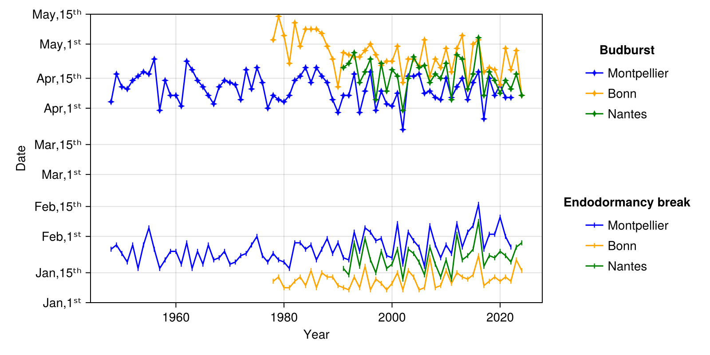

# Phenology

[](https://ArnaudG0649.github.io/Phenology.jl/stable/)
[](https://ArnaudG0649.github.io/Phenology.jl/dev/)

A julia package to predict phenological dates (endo-dormancy break and budburst) of apple and grapevine from daily temperatures data. To do that the package use apple phenology models described in Legave *et al*., (2013) and grapevine phenology models described in García de Cortázar-Atauri *et al*. (2009).

## Synopsis

This package include functions (like `extract_series`) to extract temperatures data from .txt files from two sources : 

- The [ECA&D](https://www.ecad.eu/dailydata/predefinedseries.php) database for recorded temperatures.
- The portal [DRIAS *Les futurs du climat*](https://www.drias-climat.fr/) for climate projections.

However, it does not prevent you to use temperatures data from other sources but in this case you must be able to extract your data and to convert it into a `Vector` or a `DataFrame`.

The most important functions of this package are `Apple_Phenology_Pred` and `Vine_Phenology_Pred` because they are the ones which predict the phenology dates from daily temperatures.

example : 
```julia
using Phenology

df_TG_Montpellier = extract_series("TG_Montpellier.txt")
A_EB_Montpellier, A_BB_Montpellier = Apple_Phenology_Pred(df_TG_Montpellier.TG,df_TG_Montpellier.DATE)
#A_EB_Montpellier : Predicted endo-dormancy break dates in Montpellier, France.
#A_BB_Montpellier : Predicted budburst dates in Montpellier, France.
```
N.B `Apple_Phenology_Pred(df_TG_Montpellier)` and `Apple_Phenology_Pred("TG_Montpellier.txt")` return the same output.

## CairoMakie extension

If you load [CairoMakie.jl](https://docs.makie.org/stable/explanations/backends/cairomakie.html), you can use functions to easily plot the phenology dates : 

example : 
```julia
using CairoMakie

A_EB_Bonn, A_BB_Bonn = Apple_Phenology_Pred("TG_Bonn.txt")
A_EB_Nantes, A_BB_Nantes = Apple_Phenology_Pred("TG_Nantes.txt")

colors = ["blue", "orange", "green"]
label = ["Montpellier", "Bonn", "Nantes"]
Plot_Pheno_Dates_EB_BB([A_EB_Montpellier, A_EB_Bonn, A_EB_Nantes],
    [A_BB_Montpellier, A_BB_Bonn, A_BB_Nantes],
    (10, 30),
    EB_label=label,
    BB_label=label,
    EB_colors=colors,
    BB_colors=colors
)
```

## References

Legave, J. M., Blanke, M., Christen, D., Giovannini, D., Mathieu, V., & Oger, R. (2013). A comprehensive overview of the spatial and temporal variability of apple bud dormancy release and blooming phenology in Western Europe. *International Journal of Biometeorology*, 57(2), 317-331.

García de Cortázar-Atauri, I., Brisson, N., & Gaudillere, J. P. (2009). Performance of several models for predicting budburst date of grapevine (Vitis vinifera L.). *International Journal of Biometeorology*, 53(4), 317-326.